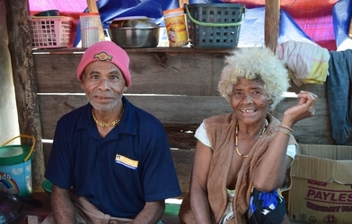

# Multi-CAST Arta

## How to cite

If you use these data please cite
- the original source
  > Kimoto, Yukinori. 2022. Multi-CAST Arta. In Haig, Geoffrey & Schnell, Stefan (eds.), Multi-CAST: Multilingual corpus of annotated spoken texts. Version 2207. Bamberg: University of Bamberg. (multicast.aspra.uni-bamberg.de/#arta) (date accessed)
- the derived dataset using the DOI of the [particular released version](../../releases/) you were using



## Description


**Arta** ([arta1239](https://glottolog.org/resource/languoid/id/arta1239)) is an endangered Austronesian language spoken by a group of hunter-gatherers living in Luzon, the Philippines. The number of fluent speakers is between nine and eleven, most of which are over the age of forty. Since all speakers have settled down in the communities of neighboring Negrito groups (Casiguran/Nagitupunan Agta people), the language is not in active use and no longer taught to children. All of the speakers are multilingual with Casiguran/Nagtipunan Agta and Ilokano.

The texts were collected by Yukinori Kimoto during fieldwork in the Quirino and Aurora provinces in Luzon between 2012 and 2018. See [Kimoto (2017)](Source#cldf:kimoto2017) for [a description of the language](MediaTable#cldf:Kimoto2017_a-grammar-of-Arta.pdf).

This dataset is licensed under a CC-BY-4.0 license

Available online at https://multicast.aspra.uni-bamberg.de/#arta


```geojson
{
    "type": "FeatureCollection",
    "features": [
        {
            "type": "Feature",
            "geometry": {
                "type": "Point",
                "coordinates": [
                    121.656,
                    16.4185
                ]
            }
        },
        {
            "type": "Feature",
            "geometry": {
                "type": "Polygon",
                "coordinates": [
                    [
                        [
                            116.656,
                            21.4185
                        ],
                        [
                            126.656,
                            21.4185
                        ],
                        [
                            126.656,
                            11.418500000000002
                        ],
                        [
                            116.656,
                            11.418500000000002
                        ],
                        [
                            116.656,
                            21.4185
                        ]
                    ]
                ]
            }
        }
    ]
}
```


## Corpus metadata

- [Annotation notes](cldf/media/annotation-notes.pdf)
- [Translated texts](cldf/media/translated-texts.pdf)
- [Kimoto2017_a grammar of arta](cldf/media/Kimoto2017_a-grammar-of-Arta.pdf)


## CLDF Datasets

The following CLDF datasets are available in [cldf](cldf):

- CLDF [TextCorpus](https://github.com/cldf/cldf/tree/master/modules/TextCorpus) at [cldf/TextCorpus-metadata.json](cldf/TextCorpus-metadata.json)